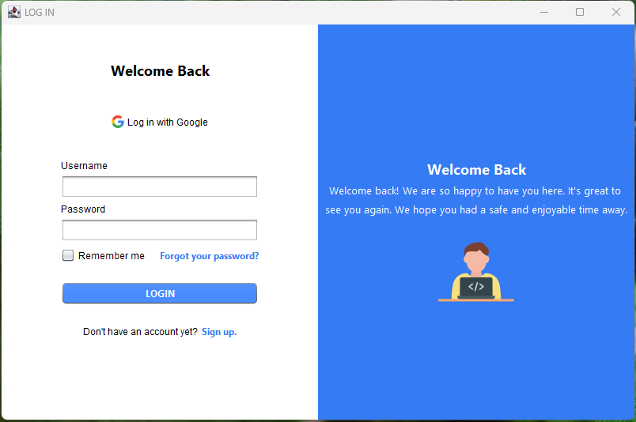
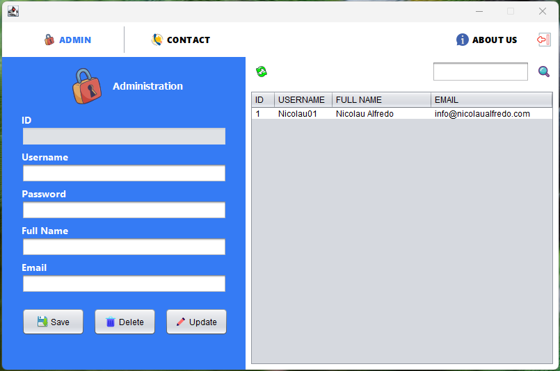
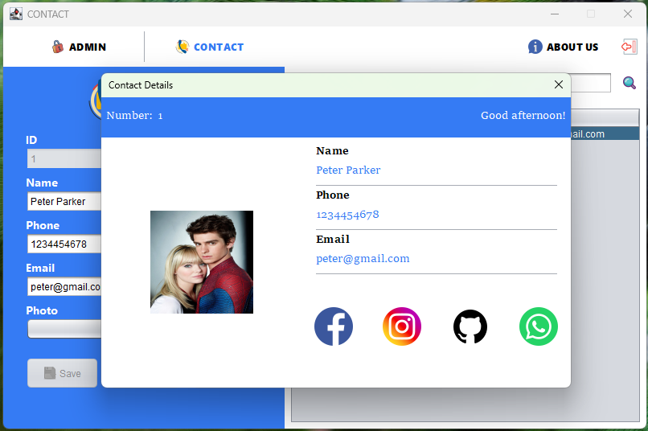

# Contact Management System

**Contact Management System** is a modern Java Swing desktop application designed to efficiently manage admin users and their contacts. It offers secure login, signup, password reset via master key, and detailed contact information with image support. The app is built using the **MVC architecture**, ensuring a clean separation of concerns, and integrates seamlessly with a MySQL database using JDBC.

---

## Key Features

- **Admin Authentication** — Secure login using SHA-256 hashed passwords.
- **Signup** — Create new admin accounts with real-time validation and duplicate checks.
- **Password Reset** — Reset admin accounts securely using a master key system.
- **Contact Viewer** — View full contact details, including name, phone, email, and profile photo.
- **Field Validation** — Email, username, password and full name are validated with clear, concise messages.
- **Navigation** — Smart navigation with Logout/Exit buttons returning to the login screen.
- **MVC Architecture** — Clear structure separating Model, View, and Controller.
- **MySQL Integration** — Uses prepared statements to safely communicate with the database.

---

## Screenshots

> _Place these screenshots in a folder like `assets/screenshots/` and embed them below:_

| Login View | Admin Dashboard | Contact Details |
|------------|-----------------|-----------------|
|  |  |  |

---

## Technologies Used

- **Java SE 24.0.1** (with Swing for GUI)
- **MySQL 8.0.x**
- **Maven** (Build tool)
- **JDBC** (Database connectivity)
- **Apache NetBeans** (Recommended IDE)

---

## Installation & Setup

### 1. Clone the Repository

```bash
git clone https://github.com/NicolauAlfredo/contactApp.git
cd contactApp
```

### 2. MySQL Setup
- Ensure MySQL Server is running.
- Create the database using the script:
- Go to the /db/ folder and run contactapp_script.sql using MySQL Workbench or your preferred tool.
  
### 3. Configure Database Credentials
- Navigate to:
```arduino
contactApp/config/
```

- Copy the example file:
```arduino
config.example.properties ➜ config.properties
```

- Fill in your MySQL username and password. Example:
```arduino
DB_URL=jdbc:mysql://localhost:3306/contactdb
DB_USER=root
DB_PASSWORD=your_mysql_password
```

---
 
## Usage
- Run the application from NetBeans or via Maven.
- Login using an existing admin account.
- Use the Sign Up page to register new admins.
- Manage contacts: Add, view, and delete entries.
- Reset admin password via the master key ("PapaiCode" by default).
- You can customize the master key in AdminPasswordResetUtil.java.

---

## Requirements

| Tool            | Version              |
| --------------- | -------------------- |
| Java JDK        | 24.0.1               |
| MySQL           | 8.0.x                |
| Apache NetBeans | Latest               |
| Maven           | Included in NetBeans |
| Git             | Latest               |

- ⚠️ Make sure Java and Maven are added to your system PATH if running via terminal.

---

## 🤝 Contributing
Pull requests are welcome!

If you'd like to contribute:
- Fork the repo.
- Create a new branch.
- Commit your changes with clear messages.
- Open a pull request.
- Follow clean code principles and Java best practices.

---

## License
- This project is licensed under the MIT License — feel free to use and adapt it as needed.

